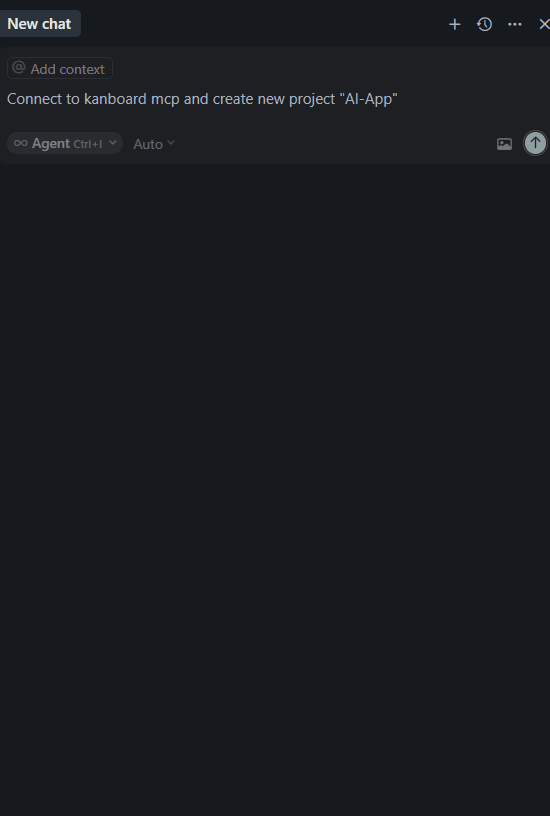

# 🚀 Kanboard MCP Server

> **Model Context Protocol (MCP) Server for Kanboard Integration**

A powerful Go-based MCP server that enables seamless integration between AI assistants (like Claude Desktop, Cursor) and Kanboard project management system. Manage your Kanboard projects, tasks, users, and workflows directly through natural language commands.




⚠️ **Warning:** To avoid issues like these:


We recommend using [mcpproxy](https://github.com/bivex/mcpproxy) as a proxy solution.


## 📋 Table of Contents

- [✨ Features](#-features)
- [🚀 Quick Start](#-quick-start)
- [⚙️ Configuration](#️-configuration)
- [🛠️ Available Tools](#️-available-tools)
- [📖 Usage Examples](#-usage-examples)
- [🔧 Development](#-development)
- [📄 License](#-license)

## ✨ Features

- 🔗 **Seamless Kanboard Integration** - Direct API communication with Kanboard
- 🤖 **Natural Language Processing** - Use plain English to manage your projects
- 📊 **Complete Project Management** - Handle projects, tasks, users, columns, and more
- 🔐 **Secure Authentication** - Support for both API key and username/password auth
- ⚡ **High Performance** - Built with Go for optimal performance
- 🎯 **MCP Standard** - Compatible with all MCP clients

## 🚀 Quick Start

### Prerequisites

- Go 1.21 or higher
- Kanboard instance with API access
- MCP-compatible client (Cursor, Claude Desktop, etc.)

### Installation

1. **Clone the repository:**
   ```bash
   git clone https://github.com/bivex/kanboard-mcp.git
   cd kanboard-mcp
   ```

2. **Build the executable:**

   **On Windows:**
   ```cmd
   build-release.bat
   ```

   **On Linux/macOS:**
   ```bash
   ./build-release.sh
   ```

   **Manual build:**
   ```bash
   go build -ldflags="-s -w" -o kanboard-mcp .
   ```

## ⚙️ Configuration

### 1. Environment Variables

Set up your Kanboard credentials and RBAC permissions using environment variables:

#### Required Credentials:
```bash
export KANBOARD_API_ENDPOINT="https://your-kanboard-url/jsonrpc.php"
export KANBOARD_API_KEY="your-kanboard-api-key"
export KANBOARD_USERNAME="your-kanboard-username"
export KANBOARD_PASSWORD="your-kanboard-password"
```

#### RBAC Configuration (Optional):
Configure user roles for proper access control. If not set, the system will try to get roles from Kanboard API, falling back to `app-user` role.

```bash
# Application-level roles (comma-separated)
# If not set, roles are automatically retrieved from Kanboard API
export KANBOARD_USER_APP_ROLES="app-manager"

# Project-specific roles (format: "project_id:role,project_id:role")
# If not set, project roles are automatically retrieved from Kanboard API
export KANBOARD_USER_PROJECT_ROLES="1:project-manager,2:project-member"

# Debug mode - shows detailed permission checking logs
export KANBOARD_DEBUG="true"

# Skip RBAC checks for debugging (use with caution!)
export KANBOARD_SKIP_RBAC="false"
```

**Available Application Roles:**
- `app-admin` - Full system administrator access
- `app-manager` - Can create projects and manage users
- `app-user` - Basic user access (default)

**Available Project Roles:**
- `project-manager` - Full project management access
- `project-member` - Can create/modify tasks and comments
- `project-viewer` - Read-only access to project

**🔐 Authentication Methods:**

Kanboard supports different authentication methods via `KANBOARD_AUTH_METHOD`:

- **`global_token`** (default): Uses global API token with `jsonrpc:<token>` format
  ```bash
  export KANBOARD_API_KEY="5348e6b4846fe09fd1670e922bc13e086f0827d7a66e45815cd7c3a7f67b"
  export KANBOARD_AUTH_METHOD="global_token"  # or omit (default)
  ```

- **`user_token`**: Uses user-specific API token with `<username>:<token>` format
  ```bash
  export KANBOARD_USERNAME="admin"
  export KANBOARD_API_KEY="81820aeb3454985b0ac12166225f1f072f523175a752541c8670cf44a032d"
  export KANBOARD_AUTH_METHOD="user_token"
  ```

- **`bearer`**: Uses Bearer token authentication
  ```bash
  export KANBOARD_API_KEY="your-token-here"
  export KANBOARD_AUTH_METHOD="bearer"
  ```

**🔧 Troubleshooting RBAC Issues:**

If you're getting "access denied" errors:

1. **Check your user role in Kanboard:**
   - Go to Kanboard web interface
   - Check your user profile/role settings
   - Ensure you have appropriate permissions

2. **Enable debug logging:**
   ```bash
   export KANBOARD_DEBUG="true"
   ```
   This will show your current roles and permission checks in the console.

3. **Temporarily skip RBAC for testing:**
   ```bash
   export KANBOARD_SKIP_RBAC="true"
   ```
   ⚠️ **Warning:** Only use for debugging! Disables all permission checks.

4. **Manually set roles via environment:**
   ```bash
   export KANBOARD_USER_APP_ROLES="app-admin"
   export KANBOARD_USER_PROJECT_ROLES="27:project-manager"
   ```

### 2. MCP Client Configuration

Create the MCP configuration file for your client:

**Location:**
- **Windows:** `C:\Users\YOUR_USERNAME\AppData\Roaming\Cursor\.cursor\mcp_config.json`
- **Linux/macOS:** `~/.cursor/mcp_config.json`

**Configuration:**
```json
{
  "mcpServers": {
    "kanboard-mcp-server": {
      "command": "/path/to/your/kanboard-mcp",
      "args": [],
      "env": {
        "KANBOARD_API_ENDPOINT": "https://your-kanboard-url/jsonrpc.php",
        "KANBOARD_API_KEY": "your-kanboard-api-key",
        "KANBOARD_USERNAME": "your-kanboard-username",
        "KANBOARD_PASSWORD": "your-kanboard-password",
        "KANBOARD_USER_APP_ROLES": "app-manager",
        "KANBOARD_USER_PROJECT_ROLES": "1:project-manager"
      }
    }
  }
}
```

### 3. Restart Your Client

After saving the configuration, restart your MCP client (Cursor, Claude Desktop, etc.) for changes to take effect.

## 🛠️ Available Tools

### 📁 Project Management

| Tool | Description | Example |
|------|-------------|---------|
| `get_projects` | 📋 List all projects | "Show me all Kanboard projects" |
| `create_project` | ➕ Create new projects | "Create a project called 'Website Redesign' with description 'Redesign the company website' and owner 1" |
| `get_project_by_id` | 🔍 Get project information by ID | "Get project details for ID 123" |
| `get_project_by_name` | 🔍 Get project information by name | "Get project details for name 'My Project'" |
| `get_project_by_identifier` | 🔍 Get project information by identifier | "Get project details for identifier 'WEB-APP'" |
| `get_project_by_email` | 🔍 Get project information by email | "Get project details for email 'project@example.com'" |
| `get_all_projects` | 📋 Get all available projects | "Show me all available projects" |
| `update_project` | ✏️ Update a project | "Update project 1 with new name 'New Website' and description 'Updated description'" |
| `remove_project` | 🗑️ Remove a project | "Remove project with ID 456" |
| `enable_project` | ✅ Enable a project | "Enable project 123" |
| `disable_project` | 🚫 Disable a project | "Disable project 123" |
| `enable_project_public_access` | 🌐 Enable public access for a given project | "Enable public access for project 123" |
| `disable_project_public_access` | 🔒 Disable public access for a given project | "Disable public access for project 123" |
| `get_project_activity` | 📢 Get activity stream for a project | "Show me activity for project 123" |
| `get_project_activities` | 📊 Get Activityfeed for Project(s) | "Get activities for projects 1, 2, and 3" |

### 📝 Task Management

| Tool | Description | Example |
|------|-------------|---------|
| `get_tasks` | 📋 Get project tasks | "Get tasks for 'Website Redesign' project" |
| `create_task` | ➕ Create new tasks | "Create task 'Design homepage' in 'Website Redesign'" |
| `update_task` | ✏️ Modify existing tasks | "Update task 123 with description 'New requirements'" |
| `delete_task` | 🗑️ Remove tasks | "Delete task with ID 456" |
| `get_task` | 🔍 Get task by the unique id | "Get details for task 789" |
| `get_task_by_reference` | 🔍 Get task by the external reference | "Get task for project 1 with reference 'TICKET-1234'" |
| `get_all_tasks` | 📋 Get all available tasks | "Get all active tasks for project 1" |
| `get_overdue_tasks` | ⏰ Get all overdue tasks | "Show me all overdue tasks" |
| `get_overdue_tasks_by_project` | ⏰ Get all overdue tasks for a special project | "Show me overdue tasks for project 1" |
| `open_task` | ✅ Set a task to the status open | "Open task 123" |
| `close_task` | ❌ Set a task to the status close | "Close task 123" |
| `move_task_position` | ➡️ Move a task to another column, position or swimlane inside the same board | "Move task 123 to column 2, position 1, swimlane 1 in project 1" |
| `move_task_to_project` | ➡️ Move a task to another project | "Move task 123 to project 456" |
| `duplicate_task_to_project` | 📋 Duplicate a task to another project | "Duplicate task 123 to project 456" |
| `search_tasks` | 🔍 Find tasks by using the search engine | "Search tasks in project 2 for query 'assignee:nobody'" |
| `assign_task` | 👤 Assign tasks to users | "Assign the API task to John" |
| `set_task_due_date` | 📅 Set task deadlines | "Set due date for login task to 2024-01-15" |

### 💬 Comment Management

| Tool | Description | Example |
|------|-------------|---------|
| `create_comment` | ➕ Create a new comment | "Create a comment 'Meeting notes' for task 123 by user 1, visible to app-managers" |
| `get_task_comments` | 📋 Get task comments | "Show all comments for task 123" |
| `get_comment` | 🔍 Get comment information | "Get details for comment 789" |
| `update_comment` | ✏️ Update a comment | "Update comment 456 content to 'Revised notes'" |
| `remove_comment` | 🗑️ Remove a comment | "Remove comment with ID 101" |

### 🏗️ Column Management

| Tool | Description | Example |
|------|-------------|---------|
| `get_columns` | 📋 List project columns | "Show me all columns in project 123" |
| `get_column` | 🔍 Get a single column | "Get details for column 456" |
| `create_column` | ➕ Add new columns | "Create a 'Testing' column in project 123 with 5 task limit and description 'For UAT testing'" |
| `update_column` | ✏️ Modify column settings | "Change column 123 title to 'Review' and limit to 3 tasks, with description 'Needs final review'" |
| `change_column_position` | 🔄 Change column positions | "Move column 123 to position 3 in project 456" |
| `delete_column` | 🗑️ Remove columns | "Delete the unused 'Draft' column" |

### 🏷️ Category Management

| Tool | Description | Example |
|------|-------------|---------|
| `get_categories` | 📋 List project categories | "Show me all task categories for project 123" |
| `get_category` | 🔍 Get category information | "Get details for category 456" |
| `create_category` | ➕ Add task categories | "Create a 'Bug Fixes' category in project 123 with color 'red'" |
| `update_category` | ✏️ Modify categories | "Rename category 123 to 'Critical Issues' and set color to 'blue'" |
| `delete_category` | 🗑️ Remove categories | "Delete the unused 'Archive' category" |

### 🏊 Swimlane Management

| Tool | Description | Example |
|------|-------------|---------|
| `get_swimlanes` | 📋 List all swimlanes of a project (enabled or disabled) and sorted by position | "Show me all swimlanes for project 1" |
| `get_active_swimlanes` | 📋 Get the list of enabled swimlanes of a project (include default swimlane if enabled) | "Get active swimlanes for project 1" |
| `get_swimlane` | 🔍 Get a swimlane by ID | "Get swimlane details for ID 1" |
| `get_swimlane_by_id` | 🔍 Get a swimlane by ID | "Get swimlane details for ID 1" |
| `get_swimlane_by_name` | 🔍 Get a swimlane by name | "Get swimlane details for project 1 with name 'Swimlane 1'" |
| `change_swimlane_position` | 🔄 Move a swimlane's position (only for active swimlanes) | "Change swimlane 2 position to 3 in project 1" |
| `create_swimlane` | ➕ Add a new swimlane | "Create a swimlane 'Frontend Team' in project 1" |
| `update_swimlane` | ✏️ Update swimlane properties | "Update swimlane 1 for project 1 with new name 'Cross-Platform Team'" |
| `remove_swimlane` | 🗑️ Remove a swimlane | "Remove swimlane 1 from project 2" |
| `disable_swimlane` | 🚫 Disable a swimlane | "Disable swimlane 1 from project 2" |
| `enable_swimlane` | ✅ Enable a swimlane | "Enable swimlane 1 from project 2" |

### 📋 Board Management

| Tool | Description | Example |
|------|-------------|---------|
| `get_board` | 📋 Get all necessary information to display a board | "Show me the board for project 123" |

### 🧑‍💻 Current User Management

| Tool | Description | Example |
|------|-------------|---------|
| `get_me` | 👤 Get logged user session | "Get my user session information" |
| `get_my_dashboard` | 📊 Get the dashboard of the logged user | "Show me my dashboard" |
| `get_my_activity_stream` | 📢 Get the last 100 events for the logged user | "Show me my recent activity" |
| `create_my_private_project` | ➕ Create a private project for the logged user | "Create a private project named 'My Secret Project' with description 'For personal tasks'" |
| `get_my_projects_list` | 📋 Get projects of the connected user | "List all projects I'm involved in" |
| `get_my_overdue_tasks` | ⏰ Get my overdue tasks | "Show me all my tasks that are overdue" |
| `get_my_projects` | 📝 Get projects of connected user with full details | "Get detailed information about all my projects" |

### 🔗 External Task Link Management

| Tool | Description | Example |
|------|-------------|---------|
| `get_external_task_link_types` | 📋 Get all registered external link providers | "Show me all external link types" |
| `get_ext_link_provider_deps` | ⛓️ Get available dependencies for a given provider | "Get dependencies for 'weblink' provider" |
| `create_external_task_link` | ➕ Create a new external link | "Create an external link for task 123 to 'http://example.com/doc.pdf' with dependency 'related' and type 'attachment'" |
| `update_external_task_link` | ✏️ Update external task link | "Update external link 456 for task 789 with new title 'Updated Document' and URL 'http://new.example.com/doc.pdf'" |
| `get_external_task_link_by_id` | 🔍 Get an external task link by ID | "Get external link 456 for task 789" |
| `get_all_external_task_links` | 📋 Get all external links attached to a task | "Show all external links for task 123" |
| `remove_external_task_link` | 🗑️ Remove an external link | "Remove external link 456 from task 789" |

### 🔗 Internal Task Link Management

| Tool | Description | Example |
|------|-------------|---------|
| `create_task_link` | ➕ Create a link between two tasks | "Create a link between task 123 and task 456 with link type 1" |
| `update_task_link` | ✏️ Update task link | "Update task link 789 between task 123 and task 456 with new link type 2" |
| `get_task_link_by_id` | 🔍 Get a task link by ID | "Get details for task link 101" |
| `get_all_task_links` | 📋 Get all links related to a task | "Show all links for task 123" |
| `remove_task_link` | 🗑️ Remove a link between two tasks | "Remove task link 101" |

### 🔗 Link Management

| Tool | Description | Example |
|------|-------------|---------|
| `get_all_links` | 📋 Get the list of possible relations between tasks | "Show all possible task relations" |
| `get_opposite_link_id` | 🔍 Get the opposite link id of a task link | "Get the opposite link ID for link 2" |
| `get_link_by_label` | 🔍 Get a link by label | "Get details for link with label 'blocks'" |
| `get_link_by_id` | 🔍 Get a link by ID | "Get details for link with ID 4" |
| `create_link` | ➕ Create a new task relation | "Create a link 'foo' with opposite label 'bar'" |
| `update_link` | ✏️ Update a link | "Update link 14 with opposite link 12 and label 'boo'" |
| `remove_link` | 🗑️ Remove a link | "Remove link with ID 14" |

### 📂 Project File Management

| Tool | Description | Example |
|------|-------------|---------|
| `create_project_file` | ➕ Create and upload a new project attachment | "Create a file 'My Document.pdf' for project 1 with base64 content 'Zm9vYmFy'" |
| `get_all_project_files` | 📋 Get all files attached to a project | "Show all files for project 123" |
| `get_project_file` | 🔍 Get file information | "Get details for file 456 in project 123" |
| `download_project_file` | 📥 Download project file contents (encoded in base64) | "Download file 456 from project 123" |
| `remove_project_file` | 🗑️ Remove a file associated to a project | "Remove file 456 from project 123" |
| `remove_all_project_files` | 🗑️ Remove all files associated to a project | "Remove all files from project 123" |

### 📝 Project Metadata Management

| Tool | Description | Example |
|------|-------------|---------|
| `get_project_metadata` | 📋 Get Project metadata | "Get all metadata for project 123" |
| `get_project_metadata_by_name` | 🔍 Fetch single metadata value | "Get metadata 'my_key' for project 123" |
| `save_project_metadata` | 💾 Add or update metadata | "Save metadata 'key1:value1, key2:value2' for project 123" |
| `remove_project_metadata` | 🗑️ Remove a project metadata | "Remove metadata 'my_key' from project 123" |

### 🔐 Project Permission Management

| Tool | Description | Example |
|------|-------------|---------|
| `get_project_users` | 📋 Get all members of a project | "Show all users in project 123" |
| `get_assignable_users` | 👥 Get users that can be assigned to a task for a project (all members except viewers) | "Get assignable users for project 123" |
| `add_project_user` | ➕ Grant access to a project for a user | "Add user 1 to project 123 with role 'project-member'" |
| `add_project_group` | ➕ Grant access to a project for a group | "Add group 456 to project 123 with role 'project-viewer'" |
| `remove_project_user` | 🗑️ Revoke user access to a project | "Remove user 1 from project 123" |
| `remove_project_group` | 🗑️ Revoke group access to a project | "Remove group 456 from project 123" |
| `change_project_user_role` | ✏️ Change role of a user for a project | "Change user 1's role in project 123 to 'project-manager'" |
| `change_project_group_role` | ✏️ Change role of a group for a project | "Change group 456's role in project 123 to 'project-manager'" |
| `get_project_user_role` | 🔍 Get the role of a user for a given project | "Get the role of user 1 in project 123" |

### 📝 Subtask Management

| Tool | Description | Example |
|------|-------------|---------|
| `create_subtask` | ➕ Create a new subtask | "Create a subtask 'Review designs' for task 123 with user 1 assigned" |
| `get_subtask` | 🔍 Get subtask information | "Get details for subtask 456" |
| `get_all_subtasks` | 📋 Get all available subtasks for a task | "Show all subtasks for task 123" |
| `update_subtask` | ✏️ Update a subtask | "Update subtask 456 for task 123 to status 2 (Done)" |
| `remove_subtask` | 🗑️ Remove a subtask | "Remove subtask with ID 456" |

### ⏰ Subtask Time Tracking

| Tool | Description | Example |
|------|-------------|---------|
| `has_subtask_timer` | ⏱️ Check if a timer is started for the given subtask and user | "Check if a timer is active for subtask 123 by user 4" |
| `set_subtask_start_time` | ▶️ Start subtask timer for a user | "Start timer for subtask 123 by user 4" |
| `set_subtask_end_time` | ⏹️ Stop subtask timer for a user | "Stop timer for subtask 123 by user 4" |
| `get_subtask_time_spent` | 📊 Get time spent on a subtask for a user | "Get time spent on subtask 123 by user 4" |

### 🏷️ Tag Management

| Tool | Description | Example |
|------|-------------|---------|
| `get_all_tags` | 📋 Get all tags | "Show all available tags" |
| `get_tags_by_project` | 📋 Get all tags for a given project | "Show tags for project 123" |
| `create_tag` | ➕ Create a new tag | "Create tag 'backend' for project 123 with color 1" |
| `update_tag` | ✏️ Rename a tag | "Rename tag 456 to 'frontend' and set color to 2" |
| `remove_tag` | 🗑️ Remove a tag | "Remove tag with ID 456" |
| `set_task_tags` | 🏷️ Assign/Create/Update tags for a task | "Set tags 'urgent', 'bug' for task 123 in project 456" |
| `get_task_tags` | 🔍 Get assigned tags to a task | "Get tags assigned to task 123" |

### 📂 Task File Management

| Tool | Description | Example |
|------|-------------|---------|
| `create_task_file` | ➕ Create and upload a new task attachment | "Create a file 'meeting_notes.txt' for project 1 with task 2 and base64 content 'Zm9vYmFy'" |
| `get_all_task_files` | 📋 Get all files attached to task | "Show all files for task 123" |
| `get_task_file` | 🔍 Get file information | "Get details for file 456" |
| `download_task_file` | 📥 Download file contents (encoded in base64) | "Download file 456" |
| `remove_task_file` | 🗑️ Remove file | "Remove file with ID 456" |
| `remove_all_task_files` | 🗑️ Remove all files associated to a task | "Remove all files from task 123" |

### 📝 Task Metadata Management

| Tool | Description | Example |
|------|-------------|---------|
| `get_task_metadata` | 📋 Get all metadata related to a task by task unique id | "Get all metadata for task 1" |
| `get_task_metadata_by_name` | 🔍 Get metadata related to a task by task unique id and metakey (name) | "Get metadata 'metaKey1' for task 1" |
| `save_task_metadata` | 💾 Save/update task metadata | "Save metadata 'metaName:metaValue' for task 1" |
| `remove_task_metadata` | 🗑️ Remove task metadata by name | "Remove metadata 'metaKey1' from task 1" |

### ⚙️ Application Management

| Tool | Description | Example |
|------|-------------|---------|
| `get_version` | 📋 Get the application version | "What is the Kanboard version?" |
| `get_timezone` | 🌐 Get the timezone of the connected user | "What is my current timezone?" |
| `get_default_task_colors` | 🌈 Get all default task colors | "Show me all default task colors" |
| `get_default_task_color` | 🎨 Get default task color | "What is the default task color?" |
| `get_color_list` | 📋 Get the list of task colors | "List all available task colors" |
| `get_application_roles` | 👥 Get the application roles | "List all application roles" |
| `get_project_roles` | 👥 Get the project roles | "List all project roles" |

### 🤖 Automatic Actions Management

| Tool | Description | Example |
|------|-------------|---------|
| `get_available_actions` | 📋 Get list of available automatic actions | "Show available automatic actions" |
| `get_available_action_events` | 📋 Get list of available events for actions | "Show available action events" |
| `get_compatible_action_events` | 🔍 Get list of events compatible with an action | "Get compatible events for action 'TaskClose'" |
| `get_actions` | 📋 Get list of actions for a project | "Get actions for project 123" |
| `create_action` | ➕ Create an action | "Create an action for project 1, event 'task.move.column', action '\Kanboard\Action\TaskClose', with params 'column_id:3'" |
| `remove_action` | 🗑️ Remove an action | "Remove action with ID 456" |

### 👥 Group Management

| Tool | Description | Example |
|------|-------------|---------|
| `create_group` | ➕ Create a new group | "Create a group named 'Development Team' with external ID 'dev_001'" |
| `update_group` | ✏️ Update a group | "Rename group 123 to 'QA Team' and change its external ID to 'qa_001'" |
| `remove_group` | 🗑️ Remove a group | "Remove group with ID 456" |
| `get_group` | 🔍 Get one group | "Get details for group 789" |
| `get_all_groups` | 📋 Get all groups | "Show me all user groups" |

### 👥 Group Member Management

| Tool | Description | Example |
|------|-------------|---------|
| `get_member_groups` | 📋 Get all groups for a given user | "Show me all groups for user 1" |
| `get_group_members` | 👥 Get all members of a group | "List all members of group 123" |
| `add_group_member` | ➕ Add a user to a group | "Add user 456 to group 789" |
| `remove_group_member` | 🗑️ Remove a user from a group | "Remove user 456 from group 789" |
| `is_group_member` | ❓ Check if a user is member of a group | "Is user 456 a member of group 789?" |

### 👥 User Management

| Tool | Description | Example |
|------|-------------|---------|
| `get_users` | 📋 List all system users | "Show me all users" |
| `create_user` | ➕ Create a new user | "Create user 'john' with password '123456'" |
| `create_ldap_user` | ➕ Create a new user authenticated by LDAP | "Create LDAP user 'jane'" |
| `get_user` | 🔍 Get user information by ID | "Get user details for ID 123" |
| `get_user_by_name` | 🔍 Get user information by username | "Get user details for 'john'" |
| `update_user` | ✏️ Update a user | "Update user 123 with role 'app-manager'" |
| `remove_user` | 🗑️ Remove a user | "Remove user with ID 456" |
| `disable_user` | ❌ Disable a user | "Disable user 123" |
| `enable_user` | ✅ Enable a user | "Enable user 123" |
| `is_active_user` | 🔍 Check if a user is active | "Check if user 123 is active" |
| `assign_user_to_project` | 👤 Assign a user to a project with a specific role | "Assign user 1 to project 'Website' with role 'project-member'" |

### 🏃 ScrumSprint Plugin API

| Tool | Description | Example |
|------|-------------|---------|
| `create_sprint` | ➕ Create a new sprint | "Create a sprint named 'Sprint 1' in project 'My Project' starting '2024-01-01' and ending '2024-01-14' with goal 'Complete onboarding features'" |
| `get_sprint_by_id` | 🔍 Retrieve a sprint by its ID | "Get details for sprint with ID 123" |
| `update_sprint` | ✏️ Update an existing sprint | "Update sprint 123 in project 'My Project' to be completed" |
| `remove_sprint` | 🗑️ Remove a sprint by its ID | "Remove sprint with ID 123" |
| `get_all_sprints_by_project` | 📋 Retrieve all sprints for a given project | "Get all sprints for project 'My Project'" |

## 📖 Usage Examples

### Project Workflow

```bash
# Create a new project
"Create a new project called 'Mobile App Development'"

# Add tasks to the project
"Create task 'Design UI mockups' in project 'Mobile App Development'"
"Create task 'Set up development environment' in project 'Mobile App Development'"

# Get all tasks
"Get tasks for 'Mobile App Development' project"

# Move tasks between columns
"Move task 1 to 'In Progress' column"
"Move task 2 to 'Done' column"
```

### Team Management

```bash
# Create a new team member
"Create user 'alice.smith' with password 'secure123' and email 'alice@company.com'"

# Assign user to project
"Assign user 'alice.smith' to project 'Mobile App Development' as project-member"

# Assign tasks to team members
"Assign task 1 to user 'alice.smith'"
```

### Task Organization

```bash
# Create categories for better organization
"Create category 'Critical Bugs'"
"Create category 'Feature Requests'"

# Add comments to tasks
"Add comment 'This needs urgent attention' to task 5"

# Set deadlines
"Set due date for task 3 to 2024-01-20"
```

## 🔧 Development

### Building from Source

```bash
# Clone the repository
git clone https://github.com/bivex/kanboard-mcp.git
cd kanboard-mcp

# Install dependencies
go mod download

# Build the application
go build -o kanboard-mcp .

# Run tests
go test ./...
```

### Project Structure

```
kanboard-mcp/
├── main.go              # Main application entry point
├── go.mod               # Go module dependencies
├── go.sum               # Dependency checksums
├── build-release.bat    # Windows build script
├── build-release.sh     # Unix build script
├── README.md            # This file
└── LICENSE.md           # License information
```

### Contributing

1. Fork the repository
2. Create a feature branch (`git checkout -b feature/amazing-feature`)
3. Commit your changes (`git commit -m 'Add amazing feature'`)
4. Push to the branch (`git push origin feature/amazing-feature`)
5. Open a Pull Request

## 📄 License

This project is licensed under the MIT License - see the [LICENSE.md](LICENSE.md) file for details.

---

<div align="center">

**Made with ❤️ for the Kanboard community**

[](https://github.com/bivex/kanboard-mcp/stargazers)
[](https://github.com/bivex/kanboard-mcp/network)
[](https://github.com/bivex/kanboard-mcp/issues)

</div>
